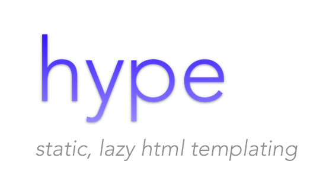

---

> this is a proof of concept that is currently being used to power https://nashvilleswift.org 

- Statically typed HTML in Swift
- Components for composition
- Small core (<200 LOC)

```swift
html {
    body {
        div {
            h1("My Blog") +
            p("hello!")
        }
    }
}
```

#### Future

- Middleware layer for rendering
- Extensible styles
- Non-css oriented layout

---

- Created by the Nashville Swift Language Group
- MIT License
